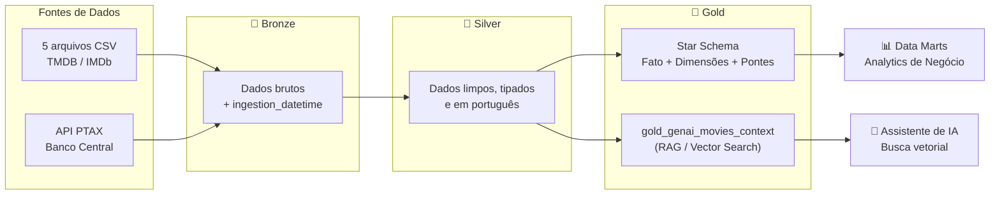
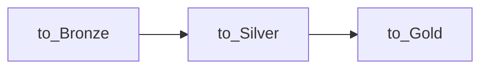
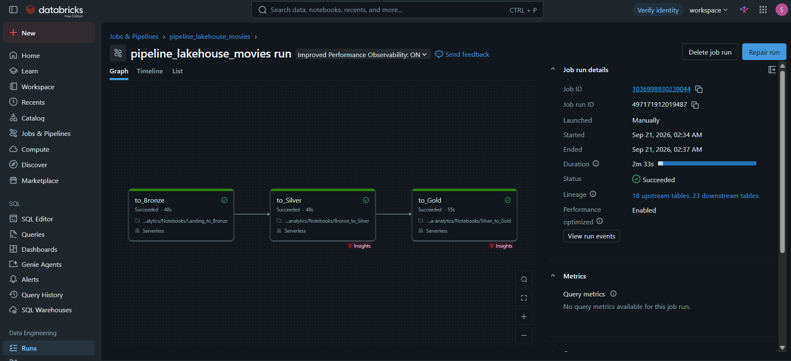

# 🎬 CineData Analytics

**Pipeline de dados end-to-end para inteligência de mercado do setor audiovisual**, construído sobre a Arquitetura Medalhão (Bronze → Silver → Gold) no Databricks Lakehouse.


---

## 📌 Sobre o projeto

O **CineData Analytics** estrutura uma base combinada TMDB/IMDb, entregue de forma intencionalmente suja e fragmentada em 5 arquivos CSV, dentro do Data Lakehouse do Databricks. O pipeline cobre todo o ciclo de ETL, desde a ingestão bruta até a modelagem dimensional (Star Schema) para consumo do time de BI e uma tabela de contexto dedicada a alimentar um assistente de Inteligência Artificial via RAG.

Além dos arquivos de origem, o pipeline enriquece a base com a **cotação diária do dólar**, obtida via API pública do Banco Central do Brasil, permitindo análises financeiras tanto em USD quanto em BRL.

---

## 🏗️ Arquitetura



O pipeline é orquestrado como um **Databricks Workflow (Job)** com três tarefas sequenciais e dependências explícitas: `to_Bronze` → `to_Silver` → `to_Gold`, executado diariamente conforme agendamento configurado (ver [`job.yaml`](./job.yaml)).

---

## 🛠️ Tecnologias utilizadas

| Tecnologia | Papel no projeto |
|---|---|
| **Databricks** | Plataforma de execução, orquestração (Workflows/Jobs) e governança (Unity Catalog) |
| **Delta Lake** | Formato de armazenamento transacional (ACID) de todas as tabelas Bronze, Silver e Gold |
| **PySpark** | Motor de processamento distribuído usado em toda a lógica de ingestão, limpeza e modelagem |
| **Unity Catalog** | Governança de catálogo, schemas, tabelas e Volumes, com controle de acesso centralizado |
| **Spark SQL** | Consultas analíticas da camada Gold, incluindo funções de janela (`RANK()`, `ROW_NUMBER()`) |
| **API REST (Bacen)** | Ingestão da cotação do dólar (serviço PTAX) para conversão de métricas financeiras |

---

## 📂 Estrutura do repositório

```
projeto-cinedata-analytics/
├── Notebooks/
│   ├── Landing_to_Bronze.ipynb
│   ├── Bronze_to_Silver.ipynb
│   ├── Silver_to_Gold.ipynb
│   └── documentacao/
│       ├── Landing_to_Bronze_Documentacao.md
│       ├── Bronze_to_Silver_Documentacao.md
│       ├── Silver_to_Gold_Documentacao.md
│       └── Desafio_Analytics_Respostas.md
├── job.yaml
└── README.md
```

---

## 📖 Documentação técnica

Cada notebook do pipeline possui uma documentação dedicada, explicando célula a célula as decisões de implementação e as regras de negócio aplicadas:

- 📄 [`Landing_to_Bronze` — Documentação](./Notebooks/documentacao/Landing_to_Bronze_Documentacao.md)
- 📄 [`Bronze_to_Silver` — Documentação](./Notebooks/documentacao/Bronze_to_Silver_Documentacao.md)
- 📄 [`Silver_to_Gold` — Documentação](./Notebooks/documentacao/Silver_to_Gold_Documentacao.md)
- 📊 [Respostas do Desafio de Analytics](./Notebooks/documentacao/Desafio_Analytics_Respostas.md)

---

## ⚙️ Orquestração do Job

O Job `pipeline_lakehouse_movies` executa diariamente às 03:00 (horário de São Paulo), com dependências explícitas entre as três etapas da Arquitetura Medalhão:



Execução de sucesso registrada no Databricks Workflows:




---

## 🚀 Como executar

1. Faça o upload dos 5 arquivos CSV de origem para o Workspace do Databricks.
2. Execute `Landing_to_Bronze` para ingerir os dados brutos e a cotação do dólar.
3. Execute `Bronze_to_Silver` para limpar, tipar e padronizar os dados.
4. Execute `Silver_to_Gold` para construir o Star Schema e a tabela de contexto de IA.
5. Ou, alternativamente, importe [`job.yaml`](./job.yaml) como um Databricks Workflow e deixe a orquestração rodar de forma agendada.

---

<p align="center">
  Desenvolvido como parte do <strong>Rocket Lab 2026.2 — Engenharia de Dados</strong>
</p>
